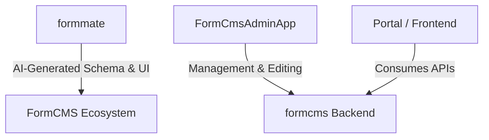

# FormCMS: The AI-Powered CMS

FormCMS is a cutting-edge, open-source Content Management System designed to revolutionize web development through AI. By automating the most tedious parts of development—schema design, data seeding, API creation, and UI building—FormCMS allows you to build complex, production-ready applications in minutes rather than weeks.

---

## ⚡ Powering Your Workflow with AI

FormCMS isn't just a place to store content; it's an AI-driven development partner. 

### 1. Generate Entity (Schema)
Forget manual table definitions. Simply describe your business domain (e.g., "I need a system to manage a digital library with books, authors, and rentals"), and FormCMS's AI will:
- Design the normalized database schema.
- Establish relationships (Many-to-One, Many-to-Many).
- Configure appropriate data types (Strings, Numbers, Lookups, Junctions).

### 2. Generate Data (Seeding)
Tired of "Lorem Ipsum"? Use AI to generate realistic, high-quality sample data:
- Populate your database with meaningful records.
- Preserve relational integrity across entities.
- Test your UI with data that looks and feels real.

### 3. Generate Query (API)
Writing GraphQL can be complex. In FormCMS, you can:
- Prompt the AI to build logic: "Give me all books published after 2020 by authors with more than 5 stars."
- The AI generates the GraphQL query and converts it into a secure, high-performance REST endpoint automatically.

### 4. Generate Page (UI)
Go from prompt to page instantly:
- "Build a landing page for my library that sections books by genre and features a search bar."
- AI generates the HTML/CSS using semantic structures and bridges it with your data queries.

---

## 🎥 In Action

Watch FormCMS build a complete Library system (Entities, Data, Queries, and UI) from scratch in under 60 seconds (sped up 10x).


---

## 🚀 Quick Start

Get the project running locally in 3 steps.

### 1. Start Support Services (Docker)
This command builds and starts the FormCMS backend and database in a container.
```bash
sh rebuild.sh
```
_Verify that `http://127.0.0.1:5000` is accessible._

### 2. Configure Environment
Copy the example environment file and add your Google Gemini API Key.
```bash
cp packages/backend/.env.example packages/backend/.env
```
Inside `.env`, set your key:
```ini
GEMINI_API_KEY=your_key_here
```

### 3. Start Development Server
Run the frontend and backend agent locally.
```bash
npm run dev
```
Visit **http://localhost:5173/mate** to start building!

---

## 🏗️ Architecture

FormCMS is built on a modern, decoupled architecture designed for performance and flexibility.



### 1. **formmate** (AI Schema & UI Builder)
The "brain" of the ecosystem. This tool leverages LLMs to architect your data models and design your UI. It translates your natural language requirements into technical configurations that the system understands.

### 2. **formcms** (Backend Engine)
The core high-performance engine built with **ASP.NET Core (C#)**.
- **REST & GraphQL**: Automatically exposes APIs for every entity you define.
- **Normalized Storage**: Optimized for speed (Sqlite, Postgres, SQL Server, MySQL supported).
- **Scale**: Designed to handle millions of records and high-concurrency environments.

### 3. **FormCmsAdminApp** (Management Dashboard)
A sleek, **React-based** administrative interface.
- Manage your entities, queries, and pages.
- Visual editors for relationships and data.
- Built-in audit logging and publication workflows.

---

